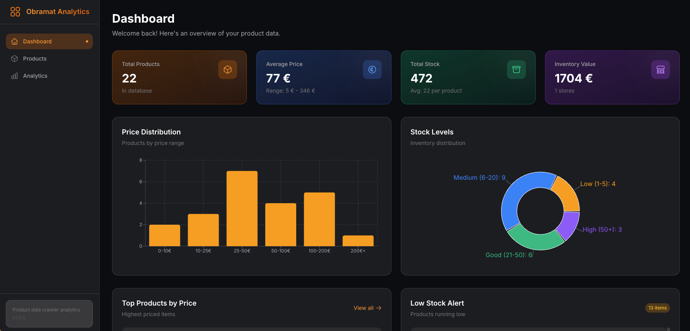
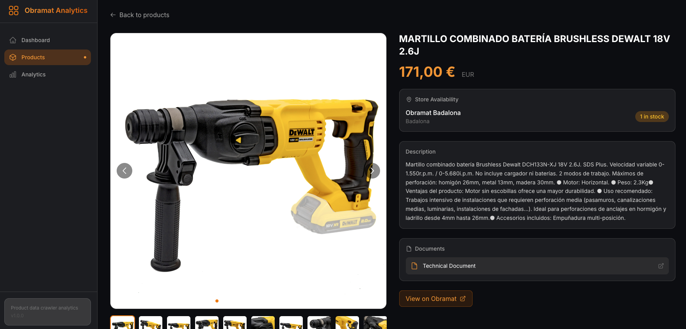
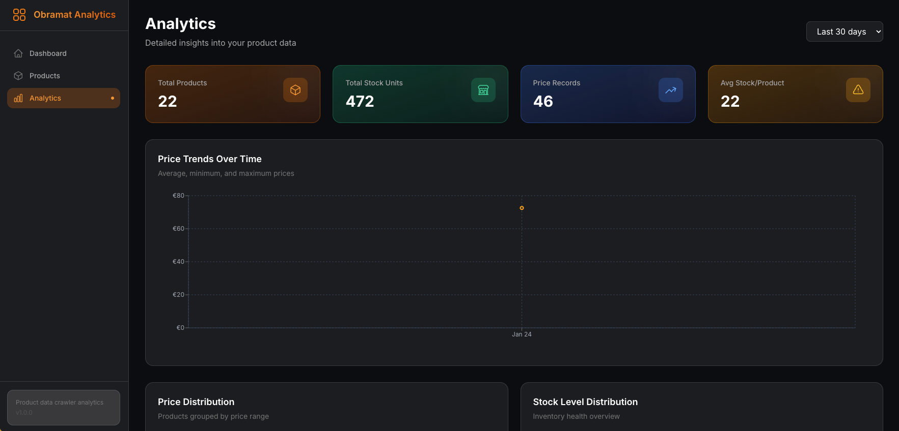
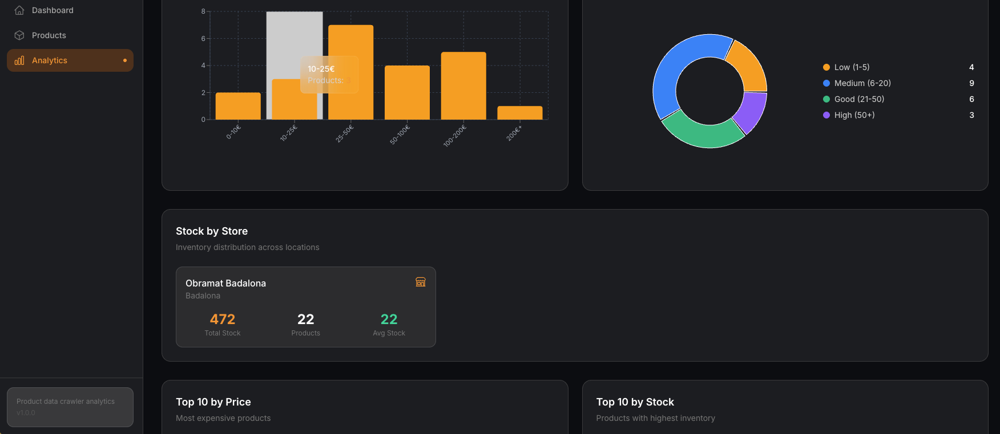

# Consumer Platform Crawler and Analytics Dashboard

EDUCATIONAL PURPOSES ONLY.

NOTE BY ALEKS: I'm open for freelance work on this or something similar. Reach me at abaikalov@uoc.edu

A sleek, modern analytics dashboard for visualizing product data from the Construction Platform web crawler.










## Features

### 📊 Dashboard Overview
- Total products, average prices, and inventory statistics
- Price distribution chart (bar chart)
- Stock levels distribution (pie chart)
- Top products by price
- Low stock alerts

### 📦 Product Management
- Paginated product list with grid/list view toggle
- Search functionality
- Filter by price range
- Sort by price, name, or date
- Product detail view with image gallery

### 📈 Product Analytics
- Historical price tracking with area charts
- Historical stock tracking
- Document downloads
- Store availability

### 📉 Global Analytics
- Price trends over time (avg, min, max)
- Price distribution analysis
- Stock level distribution
- Store-wise inventory breakdown
- Top products by price and stock

## Tech Stack

### Backend
- **Node.js** with Express.js
- **MySQL** database connection with mysql2
- RESTful API design

### Frontend
- **React 18** with Vite
- **TailwindCSS** for styling
- **Recharts** for data visualization
- **React Query** for data fetching
- **Framer Motion** for animations
- **React Router** for navigation
- **Heroicons** for icons

## Getting Started

### Prerequisites
- Node.js 18+
- MySQL 8.0+ (with, in this case, the `obramat` database from the crawler)

### Backend Setup

```bash
cd backend
npm install
```

Configure your database connection in `.env`:
```env
DB_HOST=localhost
DB_PORT=3306
DB_USER=root
DB_PASSWORD=root
DB_NAME=obramat
PORT=3001
```

Start the backend:
```bash
npm run dev
```

### Frontend Setup

```bash
cd frontend
npm install
npm run dev
```

The frontend will be available at `http://localhost:5173`

## API Endpoints

### Products
- `GET /api/products` - List products (paginated, searchable, filterable)
- `GET /api/products/:id` - Get single product with all details
- `GET /api/products/:id/price-history` - Get price history
- `GET /api/products/:id/stock-history` - Get stock history

### Analytics
- `GET /api/analytics/overview` - Dashboard statistics
- `GET /api/analytics/price-distribution` - Price range distribution
- `GET /api/analytics/stock-levels` - Stock level distribution
- `GET /api/analytics/top-products` - Top products by price or stock
- `GET /api/analytics/price-timeline` - Price trends over time
- `GET /api/analytics/store-stock` - Stock by store
- `GET /api/analytics/low-stock` - Products with low stock

## Project Structure

```
├── backend/
│   ├── src/
│   │   ├── db/
│   │   │   └── connection.js
│   │   ├── routes/
│   │   │   ├── products.js
│   │   │   └── analytics.js
│   │   └── index.js
│   ├── .env
│   └── package.json
│
├── frontend/
│   ├── src/
│   │   ├── api/
│   │   │   └── index.js
│   │   ├── components/
│   │   │   ├── Layout.jsx
│   │   │   ├── StatCard.jsx
│   │   │   ├── ProductCard.jsx
│   │   │   ├── ChartContainer.jsx
│   │   │   └── LoadingSpinner.jsx
│   │   ├── pages/
│   │   │   ├── Dashboard.jsx
│   │   │   ├── Products.jsx
│   │   │   ├── ProductDetail.jsx
│   │   │   └── Analytics.jsx
│   │   ├── App.jsx
│   │   ├── main.jsx
│   │   └── index.css
│   ├── index.html
│   ├── vite.config.js
│   ├── tailwind.config.js
│   └── package.json
│
└── consumer-platform-crawler/
    └── ... (crawler files)
```

## Screenshots

### Dashboard
The main dashboard shows an overview of all product data with key statistics and quick insights.

### Products Page
Browse all products with search, filtering, and sorting capabilities.

### Product Detail
View detailed product information including image gallery, availability, documents, and historical data charts.

### Analytics Page
Deep dive into your data with comprehensive charts and visualizations.

## License

MIT
