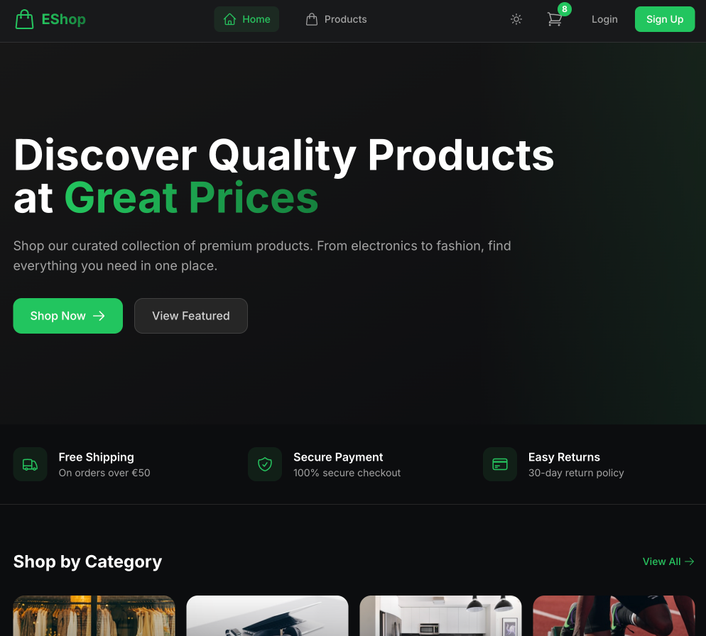
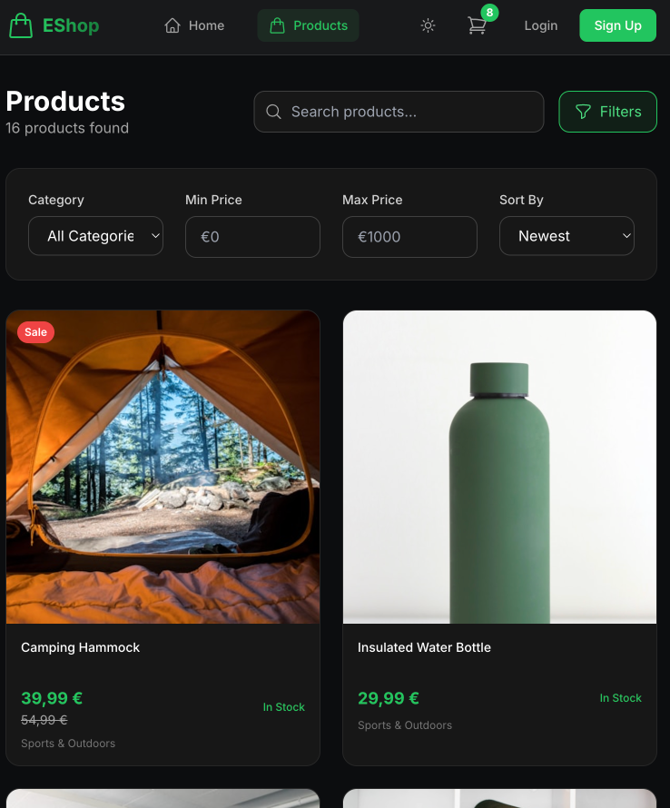

# E-Commerce Frontend




Modern, responsive e-commerce frontend built with React, Vite, and Tailwind CSS.

## Tech Stack

- **React 18** with Vite
- **TailwindCSS** for styling
- **React Query** for data fetching
- **Zustand** for state management
- **Framer Motion** for animations
- **React Router** for navigation
- **React Hot Toast** for notifications
- **Axios** for API calls
- **Heroicons** for icons

## Features

- 🛒 Shopping cart with local + server sync
- 🔐 JWT authentication with token refresh
- 🌙 Dark mode toggle
- 📱 Responsive design (mobile-first)
- 🔍 Product search with debouncing
- 📄 Paginated product lists
- ⭐ Product ratings and reviews
- 💳 Checkout flow (Stripe-ready)
- 📦 Order history

## Getting Started

### Prerequisites

- Node.js 18+
- Backend API running on port 3002

### Installation

```bash
npm install
npm run dev
```

The app will be available at `http://localhost:5174`

## Pages

| Path | Description |
|------|-------------|
| `/` | Home page with featured products |
| `/products` | Product listing with filters |
| `/products/:slug` | Product detail page |
| `/cart` | Shopping cart |
| `/checkout` | Checkout flow |
| `/orders` | Order history |
| `/orders/:id` | Order detail |
| `/profile` | User profile |
| `/login` | Login page |
| `/register` | Registration page |

## State Management

The app uses Zustand for global state:

- **authStore** - User authentication state
- **cartStore** - Shopping cart with persistence
- **themeStore** - Dark mode preference

## API Integration

API client is configured in `src/api/client.js` with:
- Automatic token attachment
- Token refresh on 401 errors
- Credential cookies support

## Environment Variables

No environment variables needed for development.
The API proxy is configured in `vite.config.js` to forward
`/api` requests to `http://localhost:3002`.

For production, set:
```env
VITE_API_URL=https://your-api-url.com
```

## License

MIT
